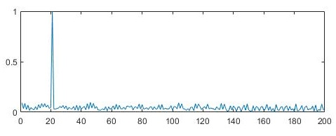
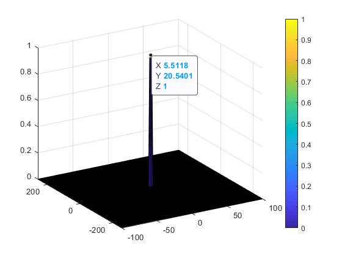

# Radar Target Generation and Detection


## System Requirements 


## Initial Range and velocity of the Target

Initial range for the target was chosen 20 meters and initial velocity was chosen to be 5 meters/sec

```
init_pose = 20;     % meters
init_velocity = 5;  % meters/sec
```

## Target Generation
### FMCW Waveform Design

Using the given system requirements, design a FMCW waveform. Find its Bandwidth (B), chirp time (Tchirp) and slope of the chirp.

```
fc= 77e9;             %carrier freq
max_range = 200;
range_resolution = 1;
max_velocity = 100;
c = 3e8; %speed of light = 3e8

% sweep bandwidth
b_sweep = c/(2*range_resolution);
% chirp time
chirp_time_multiplier = 5.5;
Tchirp = chirp_time_multiplier*2*max_range/c;
% chirp signal slope
chirp_sig_slope = b_sweep/Tchirp;
```

## Target Detection
### Simulation Loop

Simulate Target movement and calculate the beat or mixed signal for every timestamp.

```
% Running the radar scenario over the time. 
for i=1:length(t)         
    
    %For each time stamp update the Range of the Target for constant velocity. 
    r_t(i) = init_pose + init_velocity*t(i); % range at time t(i)
    td(i) = 2*r_t(i)/c;    % time delay for waves to travel r_t(i) meters
    
    %For each time sample we need update the transmitted and
    %received signal. 
    Tx(i) = cos( 2*pi*( fc*(t(i)        ) + ( 0.5 * chirp_sig_slope * t(i)^2)         ) );
    Rx(i) = cos( 2*pi*( fc*(t(i)-td(i)  ) + ( 0.5 * chirp_sig_slope * (t(i)-td(i))^2) ) );
    
    %Now by mixing the Transmit and Receive generate the beat signal
    %This is done by element wise matrix multiplication of Transmit and
    %Receiver Signal
    Mix(i) = Tx(i).*Rx(i); 
end
```

### Range FFT (1st FFT)

Implement the Range FFT on the Beat or Mixed Signal and plot the result.

```
%reshape the vector into Nr*Nd array. Nr and Nd here would also define the size of
%Range and Doppler FFT respectively.
Mix = reshape(Mix,[Nr,Nd]);

% run the FFT on the beat signal along the range bins dimension (Nr)
sig_fft1 = fft(Mix,Nr);
% normalize the fft signal
sig_fft1 = sig_fft1./max(sig_fft1);
% Take the absolute value of FFT output
sig_fft1 = abs(sig_fft1);  

% Output of FFT is double sided signal, but we are interested in only one side of the spectrum.
% Hence we throw out half of the samples.
sig_fft1_half = sig_fft1(1:Nr/2);
```



### 2D CFAR

Implement the 2D CFAR process on the output of 2D FFT operation, i.e the Range Doppler Map.

```
%% CFAR implementation

%Slide Window through the complete Range Doppler Map

%Select the number of Training Cells in both the dimensions.
Tr = 16;
Td = 12;

%Select the number of Guard Cells in both dimensions around the Cell under 
%test (CUT) for accurate estimation
Gr = 4;
Gd = 3;

% offset the threshold by SNR value in dB
snr_offset_db = 15;

% Calculate the total number of training and guard cells
N_guard = (2 * Gr + 1) * (2 * Gd + 1) - 1;  
N_training = (2 * Tr + 2 * Gr + 1) * (2 * Td + 2 * Gd + 1) - (N_guard + 1);

CFAR = zeros(size(RDM));

% Use RDM[x,y] from the output of 2D FFT above for implementing CFAR
for i = Tr+Gr+1:(Nr/2)-(Gr+Tr)
    for j = Td+Gd+1:Nd-(Gd+Td)
        
       % Create a vector to store noise_level for each iteration on training cells
        noise_level = zeros(1,1);
        
        % Calculate noise SUM in the area around CUT
        for m = i-(Tr+Gr) : i+(Tr+Gr)
            for n = j-(Td+Gd) : j+(Td+Gd)
                if (abs(i-m) > Gr || abs(j-n) > Gd)
                    noise_level = noise_level + db2pow(RDM(m,n));
                end
            end
        end
        
        % Calculate threshould from noise average then add the offset
        threshold = pow2db(noise_level/N_training);
        threshold = threshold + snr_offset_db;
        CUT = RDM(i,j);
        
        if (CUT > threshold)
            CFAR(i,j) = 1;
        end
    end
end
```



#### Following steps were taken to implement the 2D CFAR

 - Determine the number of Training cells for each dimension. Similarly, pick the number of guard cells.  
 
 ```
 %Select the number of Training Cells in both the dimensions.
 Tr = 16;
 Td = 12;
 
 %Select the number of Guard Cells in both dimensions around the Cell under 
 %test (CUT) for accurate estimation
 Gr = 4;
 Gd = 3;
 ```

 - Slide the cell under test across the complete matrix making sure the CUT has margin for Training and Guard cells from the edges.  
 
 ```
 for i = Tr+Gr+1:(Nr/2)-(Gr+Tr)
    for j = Td+Gd+1:Nd-(Gd+Td)

        % Calculate noise SUM in the area around CUT
        for m = i-(Tr+Gr) : i+(Tr+Gr)
            for n = j-(Td+Gd) : j+(Td+Gd)
            
                if (abs(i-m) > Gr || abs(j-n) > Gd)
                    
                    ...
                    
                end
            end
        end
    end
 end
 ```
 - For every iteration sum the signal level within all the training cells. To sum convert the value from logarithmic to linear using db2pow function.  
 
 ```
 noise_level = noise_level + db2pow(RDM(m,n));
 ```
 
 - Average the summed values for all of the training cells used. After averaging convert it back to logarithmic using pow2db.  
 
 ```
 % Calculate threshould from noise average then add the offset
 threshold = pow2db(noise_level/N_training);
 ```
 
 - Further add the offset to it to determine the threshold.  
 
 ```
 threshold = threshold + snr_offset_db;
 ```
 
 - Next, compare the signal under CUT against this threshold.  
 - If the CUT level > threshold assign it a value of 1, else equate it to 0.  
 
 ```
 if (CUT > threshold)
     CFAR(i,j) = 1;
 end
 ```
 
 - The process above will generate a thresholded block, which is smaller than the Range Doppler Map as the CUTs cannot be located at the edges of the matrix due to the presence of Target and Guard cells. Hence, those cells will not be thresholded. To keep the map size same as it was before CFAR, equate all the non-thresholded cells to 0.

 ```
 CFAR(union(1:(Tr+Gr),end-(Tr+Gr-1):end),:) = 0;  % Rows
 CFAR(:,union(1:(Td+Gd),end-(Td+Gd-1):end)) = 0;  % Columns 
 ```
 
### Determine target range and velocity

To determine target range and velocity, I used connected component labeling algorithm to detect blobs within thresholded 2D CFAR and then find its centroid.

```
% Find range and velocity using connected component labeling
% first find label for blobs then find their centroid
cfar_dim = size(CFAR);
CC = bwconncomp(CFAR);
S = regionprops(CC,'Centroid');

S_size = size(S);
n_objs = S_size(1);
for i=1:n_objs
    obj_range = S(i).Centroid(2) - cfar_dim(1)/2 - 1;
    obj_velocity = (S(i).Centroid(1) - cfar_dim(2)/2) * (doppler_lim(2)-doppler_lim(1))/Nd;
    res = sprintf('Object detected at distance [%f] meters with velocity [%f] m/sec', obj_range, obj_velocity);
    disp(res);
end
```
 